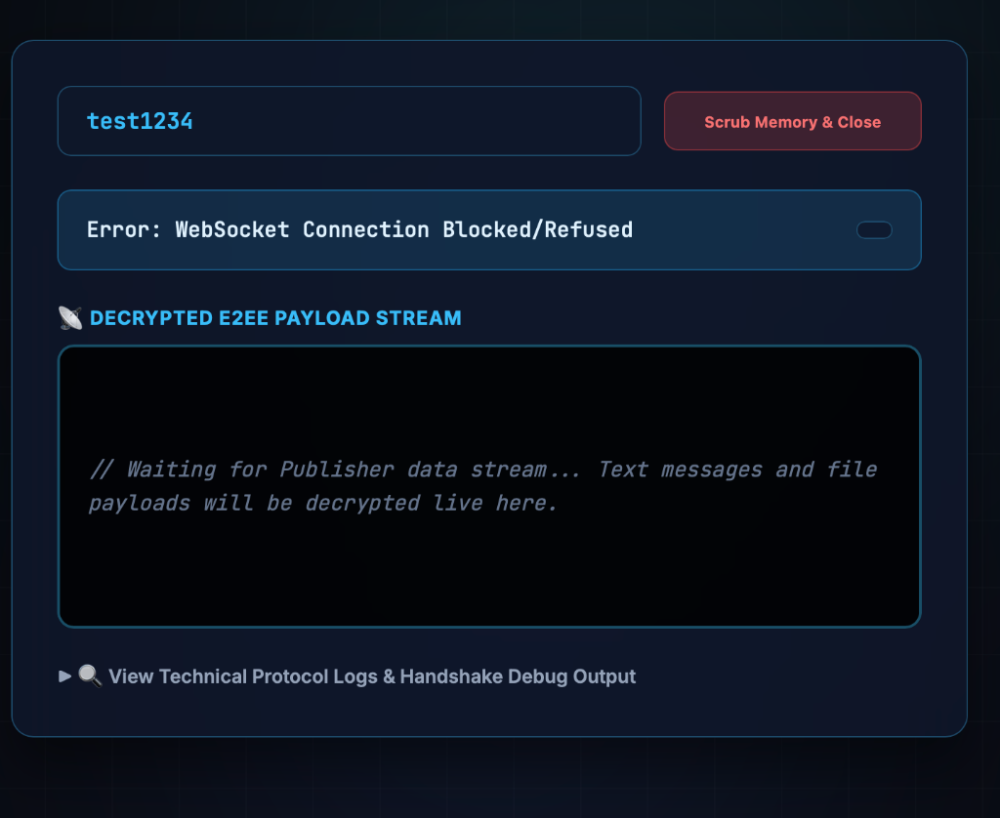

# ZeroFeed Web Landing Page & WebAssembly Client ⚡

> **Official Web Landing Page & Client-Side In-Browser E2EE WebAssembly Engine**

[](https://nicolainzerillo.github.io/ZeroFeed-Landing/)
[](https://nicolainzerillo.github.io/ZeroFeed-Landing/)
[](https://csrc.nist.gov/pubs/fips/203/final)
[](LICENSE)

This repository contains the source code for the official ZeroFeed Web Landing Page and the in-browser WebAssembly E2EE decryption engine hosted live on GitHub Pages:

👉 **[https://nicolainzerillo.github.io/ZeroFeed-Landing/](https://nicolainzerillo.github.io/ZeroFeed-Landing/)**

---

## 📺 Live WebAssembly Streaming Demo



*Figure 1: Live E2EE stream broadcast from CLI Publisher terminal to WebAssembly browser subscriber with matching SAS Verification Badges.*

---

## 🌟 Features

- **🌐 100% In-Browser Decryption**: Zero installation, zero browser extensions, zero user account registration required.
- **🛡️ NIST FIPS 203 Hybrid PQC**: SPAKE2+ hybrid key exchange (ML-KEM-768 + X25519) executing directly inside WebAssembly browser RAM.
- **🔒 Privacy-Preserving Link Hash**: `zerofeed://` URIs and `#join=...` hash fragments are processed strictly inside the local browser DOM and are **never transmitted to GitHub or HTTP web servers**.
- **⚡ Native WSS Support**: Connects natively to `wss://zerofeed.duckdns.org:8444/` with Let's Encrypt TLS certificates.
- **🇮🇹 Bilingual Internationalization**: Full English and Italian interactive UI toggle.

---

## 🏗️ Repository Architecture

- `index.html`: Responsive, glassmorphism UI with live stream terminal logs, RFC specifications, and interactive WASM controls.
- `app.js`: Client-side JavaScript orchestration, WebSocket frame encoding/decoding, and UI event binding.
- `wasm_exec.js`: Official Go WebAssembly JavaScript bridge runner.
- `zerofeed.wasm`: Static WebAssembly binary compiled from `github.com/zerofeed/zerofeed/cmd/wasm`.
- `styles.css`: Pure CSS design system with responsive layouts, dark themes, and smooth micro-animations.

---

## 🛠️ Building WebAssembly from Source

To compile `zerofeed.wasm` from the main ZeroFeed repository:

```bash
# In the main ZeroFeed repository
GOOS=js GOARCH=wasm go build -ldflags="-s -w" -o /path/to/ZeroFeed-Landing/zerofeed.wasm ./cmd/wasm
```

---

## ⚖️ License

Distributed under the **Apache License 2.0**. See `LICENSE` for details.
